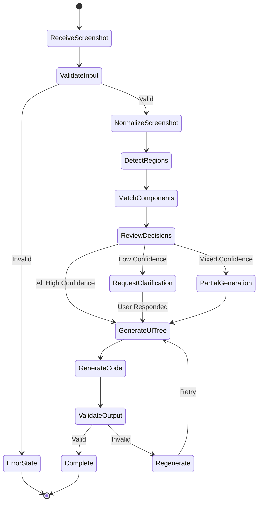
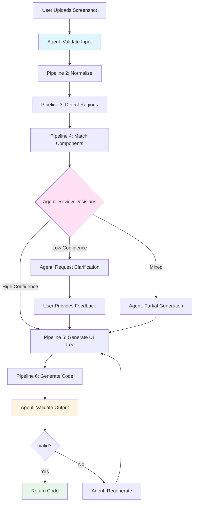
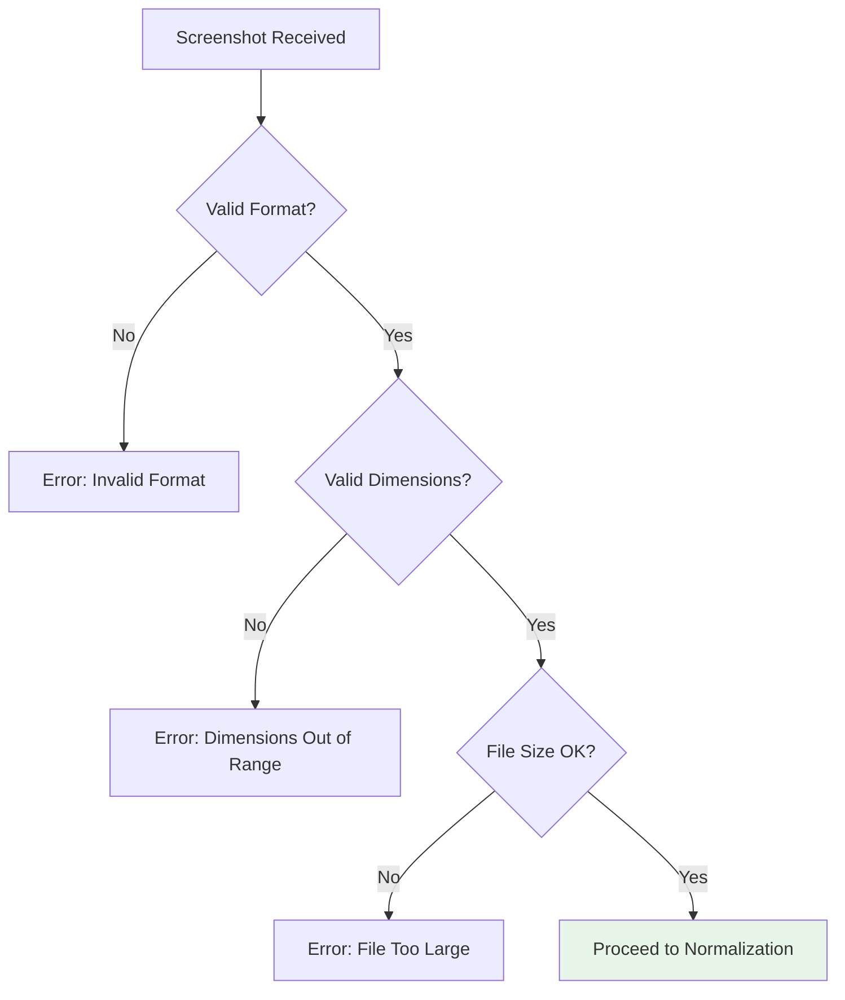
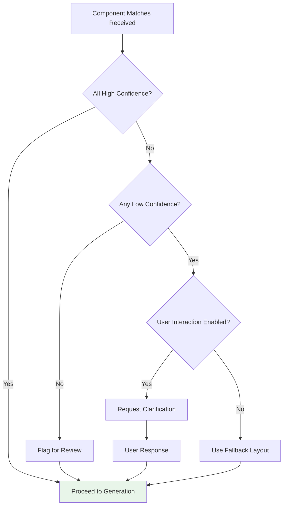
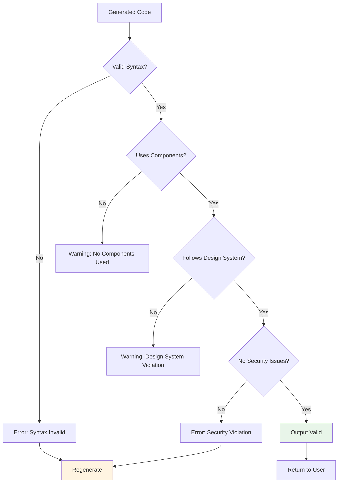
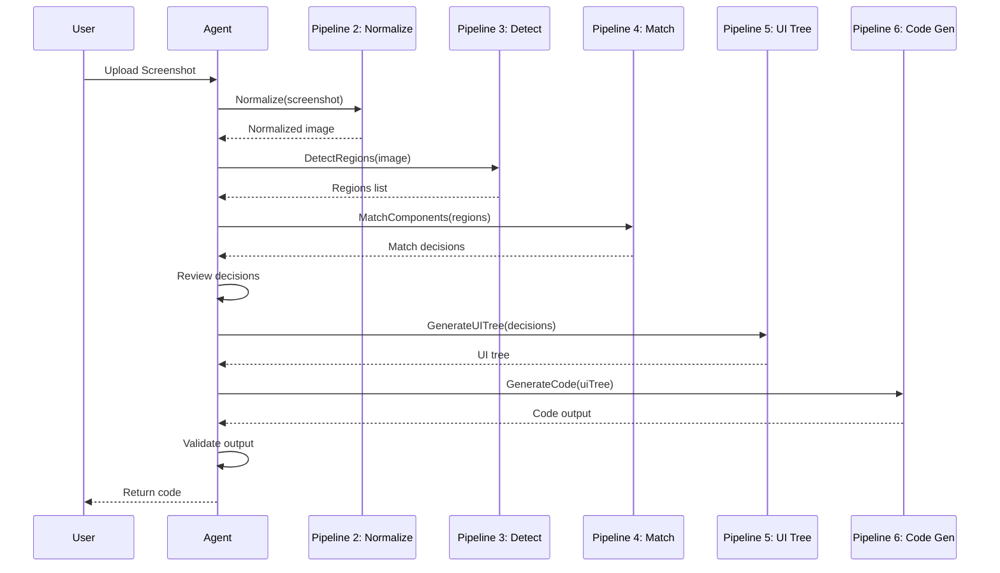

# Agent Orchestration

## Purpose

Coordinate pipeline execution, make high-level decisions, and enforce system rules. The agent acts as the central orchestrator that manages the flow from screenshot input to final code output.

## Role of the Agent

* **Coordinate pipeline execution** - Manage the sequence and dependencies of all pipelines
* **Decide between component usage vs fallback** - Apply business logic for edge cases
* **Ask clarifying questions** (future) - Interactive refinement when confidence is low
* **Enforce safety and rules** - Validate outputs, prevent unsafe code generation

## Suggested Framework

**LangGraph** - State-machine driven agents that provide:
* Explicit state management
* Conditional branching
* Error recovery
* Human-in-the-loop support

## Agent State Machine



## Orchestration Flow



## Decision Points

### 1. Input Validation



**Rules:**
* Accept: PNG, JPG, WebP
* Min dimensions: 100x100px
* Max dimensions: 10000x10000px
* Max file size: 10MB

### 2. Confidence Review



**Confidence Levels:**
* **High (≥0.85)**: Auto-proceed
* **Medium (0.70-0.84)**: Flag for review, proceed
* **Low (<0.70)**: Request clarification or fallback

### 3. Output Validation



**Validation Rules:**
* Syntax must be valid for target framework
* Prefer components over raw HTML
* No hardcoded secrets or API keys
* No dangerous eval() or innerHTML usage
* Follow accessibility guidelines

## Agent Responsibilities

### Pipeline Coordination



### Error Recovery

The agent should handle:
* **Pipeline failures**: Retry with exponential backoff
* **Partial failures**: Continue with available data
* **Timeout errors**: Return partial results with warnings
* **Rate limiting**: Queue requests and retry

### State Management

**State Schema:**
```json
{
  "sessionId": "uuid",
  "screenshot": "base64 or path",
  "normalizedScreenshot": "path",
  "regions": [],
  "matches": [],
  "uiTree": {},
  "generatedCode": "",
  "errors": [],
  "warnings": [],
  "status": "processing|complete|error"
}
```

## Safety & Rules Enforcement

### Code Safety Checks

1. **No dangerous patterns**
   * Block: `eval()`, `innerHTML`, `dangerouslySetInnerHTML` without sanitization
   * Block: Hardcoded credentials
   * Block: Direct DOM manipulation

2. **Design System Compliance**
   * Prefer components over raw HTML
   * Use design tokens (colors, spacing)
   * Follow component prop conventions

3. **Accessibility**
   * Ensure semantic HTML
   * Include ARIA labels where needed
   * Check color contrast (future)

### Rule Configuration

Rules should be configurable:
```yaml
safety:
  blockDangerousPatterns: true
  requireComponents: true
  enforceAccessibility: true
  
designSystem:
  preferComponents: true
  allowRawHTML: false
  strictMode: false
```

## Future Enhancements

### Interactive Refinement

* **Low Confidence Handling**: Ask user to confirm component matches
* **Iterative Improvement**: Allow users to refine generated code
* **Component Suggestions**: Propose alternative components

### Learning & Adaptation

* **Feedback Loop**: Learn from user corrections
* **Component Usage Patterns**: Track which components work best
* **Confidence Calibration**: Adjust thresholds based on outcomes

### Multi-Modal Input

* **Figma Integration**: Import designs directly
* **Video Input**: Process UI animations
* **Text Descriptions**: Combine with screenshots for context

## Implementation Checklist

- [ ] Set up LangGraph state machine
- [ ] Implement input validation
- [ ] Create pipeline orchestration logic
- [ ] Add confidence review logic
- [ ] Implement output validation
- [ ] Add error recovery mechanisms
- [ ] Create state persistence (optional)
- [ ] Add logging and monitoring
- [ ] Implement safety rules
- [ ] Add configuration management

