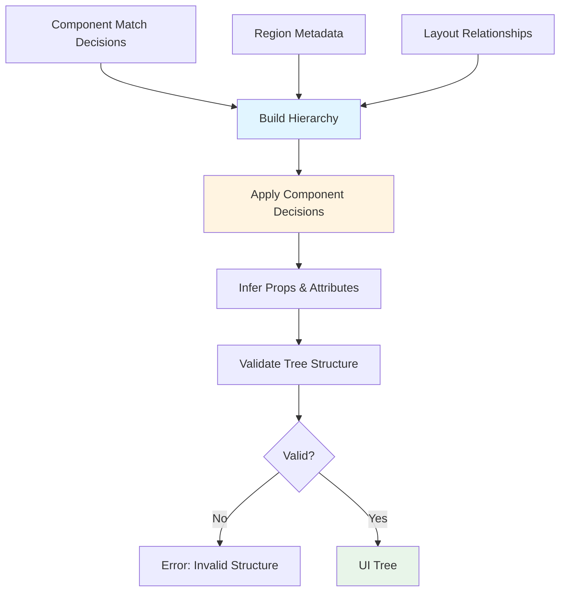
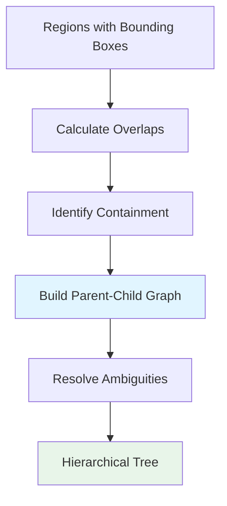
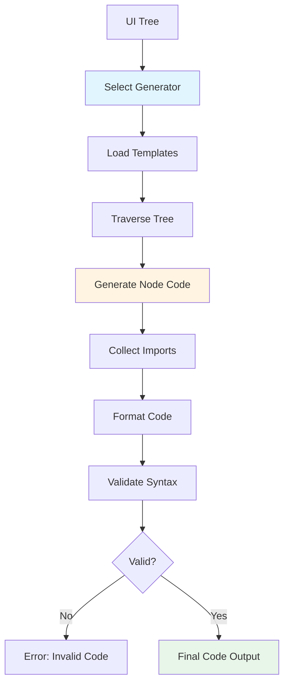
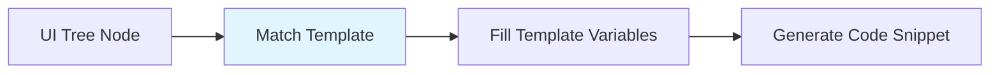
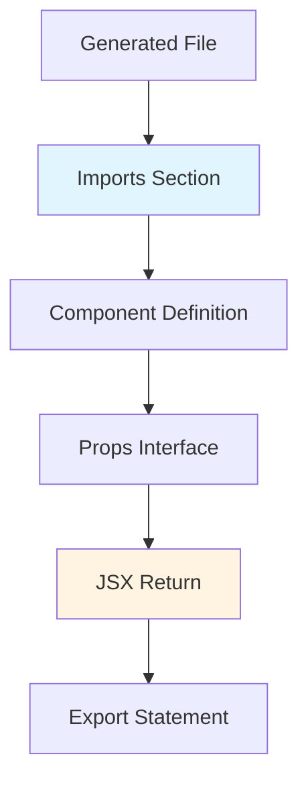
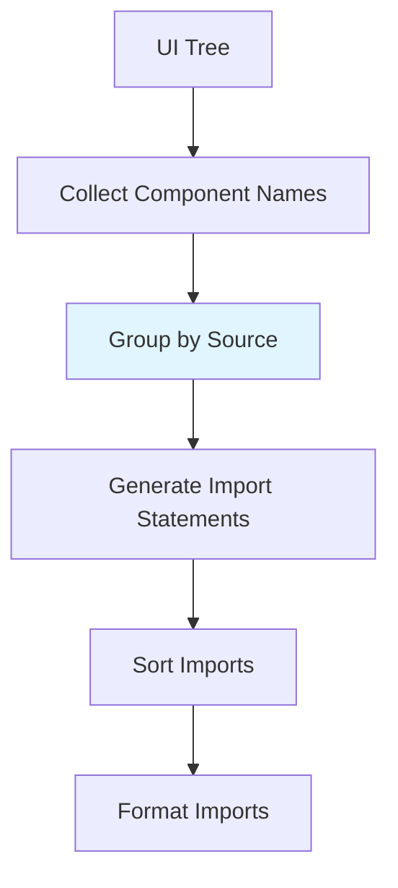
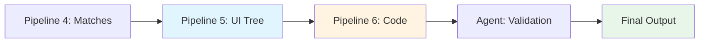

# Code Generation Guidelines

This document covers Pipeline 5 (UI Tree Composition) and Pipeline 6 (Code Generation).

## Pipeline 5: UI Tree Composition

### Purpose

Create an intermediate, structured representation of the UI. This tree structure prevents "div soup" and enables deterministic, testable code generation.

### Benefits

* **Prevents div soup** - Enforces semantic structure
* **Deterministic generation** - Same input produces same output
* **Easy debugging** - Clear representation of UI hierarchy
* **Testable** - Can validate tree structure independently

### Inputs

* Component match decisions from Pipeline 4
* Detected regions with metadata
* Layout relationships (parent-child, sibling)

### Processing Steps

1. **Build hierarchical structure**
   - Identify parent-child relationships
   - Group related regions
   - Determine layout containers

2. **Apply component decisions**
   - Insert matched components into tree
   - Apply fallback layouts where needed
   - Preserve semantic meaning

3. **Infer props and attributes**
   - Extract text content
   - Determine component sizes
   - Identify styling needs

4. **Validate tree structure**
   - Ensure valid hierarchy
   - Check for circular references
   - Verify component compatibility

### Pipeline Flow



### UI Tree Schema

See [Data Contracts](./data-contracts.md#ui-tree-schema) for the complete schema.

### Example UI Tree

```json
{
  "type": "Card",
  "component": "Card",
  "props": {
    "padding": "lg"
  },
  "children": [
    {
      "type": "Heading",
      "component": "Heading",
      "props": {
        "level": 2
      },
      "text": "Sign In"
    },
    {
      "type": "FormInput",
      "component": "FormInput",
      "props": {
        "name": "email",
        "type": "email",
        "label": "Email"
      }
    },
    {
      "type": "FormInput",
      "component": "FormInput",
      "props": {
        "name": "password",
        "type": "password",
        "label": "Password"
      }
    },
    {
      "type": "PrimaryButton",
      "component": "PrimaryButton",
      "props": {
        "size": "lg"
      },
      "text": "Login"
    }
  ]
}
```

### Hierarchy Building



**Rules:**
* Region A contains Region B if B's box is entirely within A's box
* Handle overlapping regions (z-index, visual priority)
* Root container is the full screenshot bounds

### Prop Inference

**Text Content:**
* Extract from region text field
* Clean whitespace and formatting
* Preserve line breaks where relevant

**Sizing:**
* Map bounding box dimensions to size props (sm, md, lg)
* Consider responsive breakpoints
* Maintain aspect ratios

**Styling:**
* Infer colors from region (if available)
* Map spacing to design tokens
* Preserve layout direction (row, column)

---

## Pipeline 6: Code Generation

### Purpose

Convert UI Tree into framework-specific frontend code that is production-ready and follows best practices.

### Supported Outputs (Phase-wise)

* **Phase 1**: React + Tailwind CSS
* **Phase 2**: React + Internal UI Library
* **Phase 3**: React Native (future)

### Processing Steps

1. **Select code generator**
   - Choose based on target framework
   - Load component templates

2. **Traverse UI tree**
   - Visit each node in depth-first order
   - Generate code for each node

3. **Apply formatting**
   - Consistent indentation
   - Proper imports
   - Component organization

4. **Add imports and setup**
   - Import required components
   - Add necessary hooks
   - Include styling imports

### Pipeline Flow



### Code Generation Strategies

#### Strategy 1: Template-Based



**Pros:**
* Consistent output
* Easy to customize
* Predictable formatting

**Cons:**
* Less flexible
* Requires template maintenance

#### Strategy 2: AST-Based


**Pros:**
* More flexible
* Better code quality
* Handles complex cases

**Cons:**
* More complex
* Higher implementation cost

### Example Output: React + Tailwind

**Input UI Tree:**
```json
{
  "type": "Card",
  "children": [
    { "type": "Heading", "text": "Sign In" },
    { "type": "FormInput", "name": "email" },
    { "type": "PrimaryButton", "text": "Login" }
  ]
}
```

**Generated Code:**
```tsx
import React from 'react';

export function SignInForm() {
  return (
    <div className="bg-white rounded-lg shadow-md p-6 max-w-md">
      <h2 className="text-2xl font-bold mb-4">Sign In</h2>
      <input
        type="email"
        name="email"
        className="w-full px-4 py-2 border rounded-md mb-4"
        placeholder="Email"
      />
      <button className="bg-blue-600 text-white px-6 py-2 rounded-md hover:bg-blue-700">
        Login
      </button>
    </div>
  );
}
```

### Example Output: React + Component Library

**Generated Code:**
```tsx
import React from 'react';
import { Card, CardHeader, FormInput, PrimaryButton } from '@company/ui-library';

export function SignInForm() {
  return (
    <Card padding="lg">
      <CardHeader title="Sign In" />
      <FormInput name="email" type="email" label="Email" />
      <FormInput name="password" type="password" label="Password" />
      <PrimaryButton size="lg">Login</PrimaryButton>
    </Card>
  );
}
```

### Code Quality Guidelines

#### 1. Component Organization

* **Single Responsibility**: Each component should have one clear purpose
* **Reusability**: Extract repeated patterns
* **Naming**: Use descriptive, PascalCase names

#### 2. Props and State

* **Props Inference**: Extract props from UI tree
* **Default Values**: Use sensible defaults
* **Type Safety**: Include TypeScript types (if applicable)

#### 3. Styling

* **Design Tokens**: Use design system tokens
* **Responsive**: Consider mobile/desktop variants
* **Accessibility**: Ensure proper contrast and sizing

#### 4. Code Structure



**File Structure:**
1. Imports (external libraries, components)
2. Type definitions (if TypeScript)
3. Component function/class
4. Export statement

### Import Management



**Import Rules:**
* Group imports: external → internal → relative
* Use named imports for components
* Remove unused imports
* Sort alphabetically within groups

### Formatting Standards

* **Indentation**: 2 spaces (configurable)
* **Line Length**: 100 characters max
* **Quotes**: Single quotes for JSX attributes
* **Semicolons**: Include semicolons
* **Trailing Commas**: Use in multi-line objects/arrays

### Validation

**Syntax Validation:**
* Parse generated code
* Check for syntax errors
* Validate JSX structure

**Component Validation:**
* Verify all imported components exist
* Check prop compatibility
* Ensure required props are present

### Error Handling

* **Missing Components**: Fallback to HTML equivalent
* **Invalid Props**: Use defaults or omit
* **Generation Failures**: Return partial code with errors

### Future Enhancements

* **TypeScript Support**: Generate .tsx files with types
* **Storybook Integration**: Auto-generate component stories
* **Test Generation**: Create unit test templates
* **Accessibility**: Auto-add ARIA attributes
* **Internationalization**: Support i18n keys

## Integration with Other Pipelines



