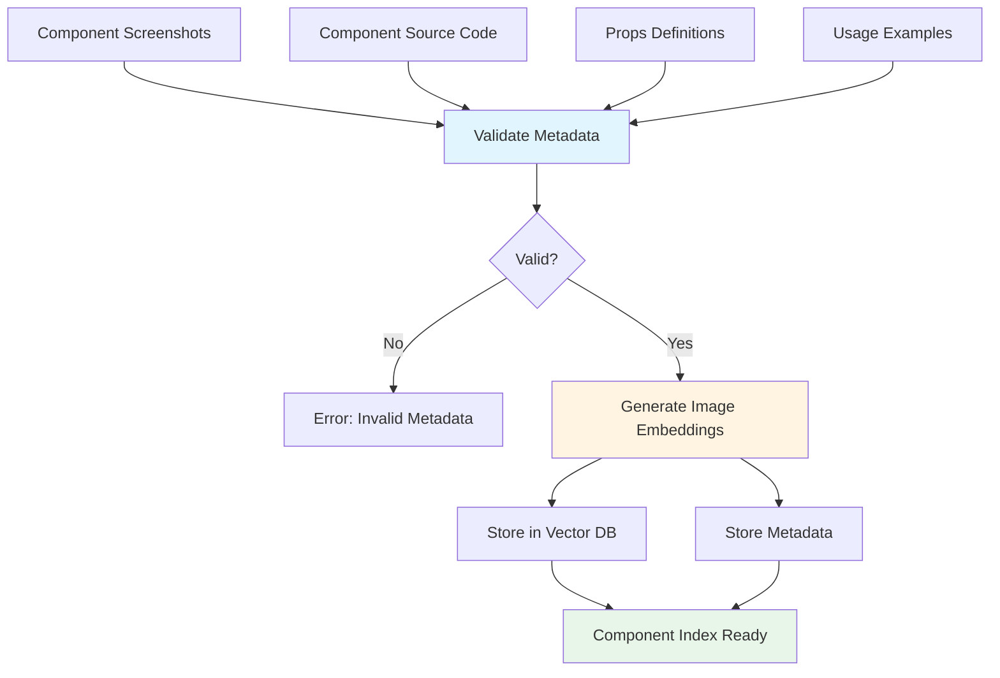

# Component Library Preprocessing Pipeline

## Purpose

Teach the system what components exist and how they look. This pipeline builds the foundation for component matching by creating a searchable index of available components.

## Inputs

- Component screenshots (PNG/JPG)
- Component source code
- Props definitions
- Usage examples

## Processing Steps

1. **Validate component metadata**

   - Ensure required fields are present
   - Validate props schema
   - Check screenshot quality

2. **Generate image embeddings**

   - Use vision model to create vector embeddings for each component screenshot
   - Store embeddings with component metadata

3. **Store in vector database**

   - Index embeddings for similarity search
   - Associate embeddings with component IDs

4. **Store component metadata**
   - Save structured component information
   - Link to source code and documentation

## Pipeline Flow

## Metadata Schema

See [Data Contracts](./data-contracts.md#component-metadata-schema) for the complete schema definition.

Key fields:

- `id` - Unique component identifier
- `componentName` - React/JSX component name
- `category` - Component category (Button, Card, Input, etc.)
- `props` - Available props and their options
- `usageExample` - Code example
- `minConfidence` - Minimum confidence threshold for matching

## Outputs

- **Vector DB Index** - Searchable embeddings of component visuals
- **Canonical Component Registry** - Structured metadata for all components

## Implementation Considerations

### Embedding Generation

- Use a vision-language model (e.g., CLIP, OpenAI Vision API)
- Ensure consistent image preprocessing before embedding
- Consider multiple screenshot angles/variants per component

### Vector Database

- Choose a database that supports similarity search (e.g., Pinecone, Weaviate, Qdrant)
- Index should support fast nearest-neighbor queries
- Consider dimensionality reduction if needed

### Metadata Storage

- Use structured storage (JSON files, database, or config files)
- Ensure versioning for component updates
- Link to source code repository

## Quality Assurance

- Validate that all required components are indexed
- Test embedding quality with sample queries
- Verify metadata completeness
- Check for duplicate component IDs

## Future Enhancements

- Automatic component discovery from codebase
- Version tracking for component changes
- Multi-variant support (dark mode, responsive sizes)
- Component relationship mapping (parent-child dependencies)
