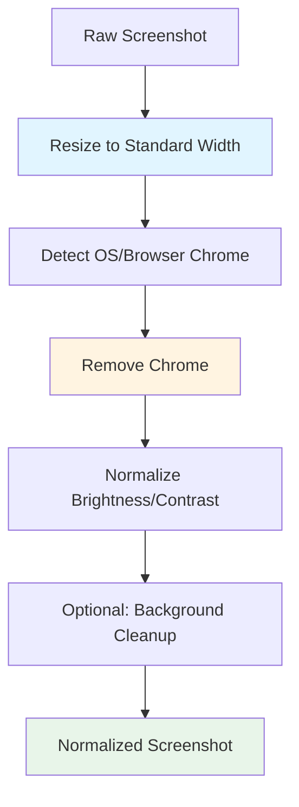
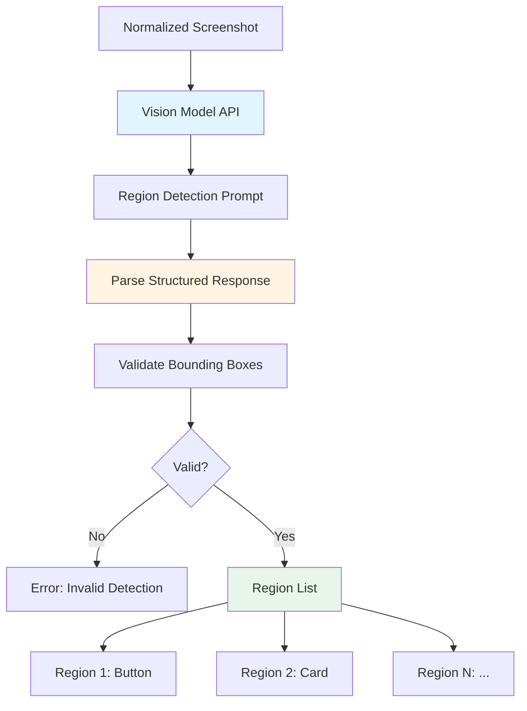
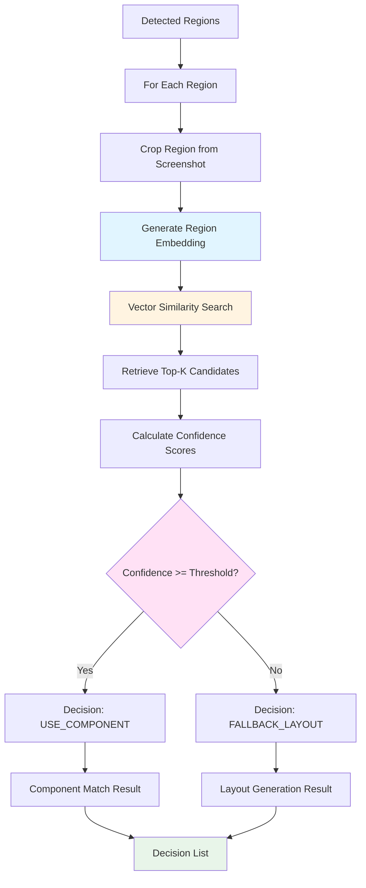
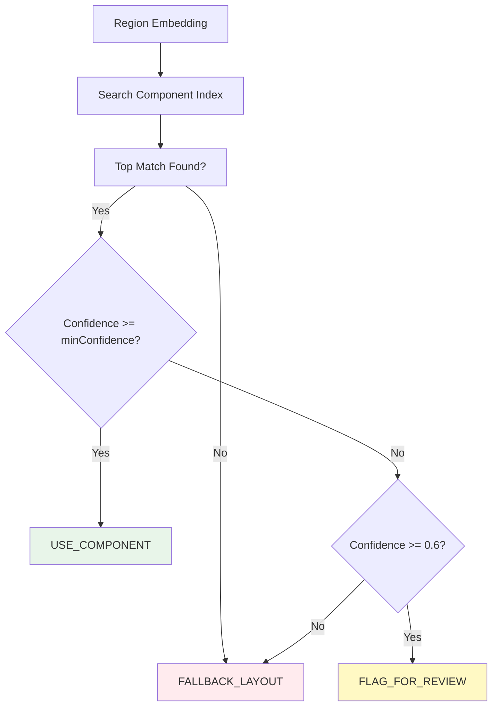
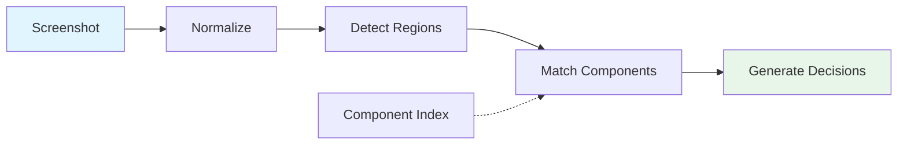

# Vision & Matching Pipeline

This document covers three interconnected pipelines: Screenshot Ingestion & Normalization, Vision & Region Detection, and Component Matching & Decision.

## Pipeline 2: Screenshot Ingestion & Normalization

### Purpose

Standardize screenshots to improve vision and matching accuracy. Consistent input format reduces variability in downstream processing.

### Inputs

* Raw UI screenshot (PNG, JPG, WebP)

### Processing Steps

1. **Resize to standard width**
   - Maintain aspect ratio
   - Target width: 1920px (configurable)

2. **Remove OS/browser chrome**
   - Detect and crop window decorations
   - Remove browser UI elements (address bar, tabs, etc.)

3. **Normalize brightness and contrast**
   - Apply histogram equalization if needed
   - Ensure consistent lighting conditions

4. **Optional background cleanup**
   - Remove noise
   - Enhance edges

### Pipeline Flow



### Outputs

* Normalized screenshot ready for vision processing

---

## Pipeline 3: Vision & Region Detection

### Purpose

Understand the structure of the UI screenshot by identifying distinct UI regions and their semantic types.

### Processing Steps

1. **Pass screenshot to multimodal vision model**
   - Use GPT-4 Vision, Claude Vision, or similar
   - Request structured region detection

2. **Detect UI regions**
   - Identify buttons, cards, lists, inputs, text blocks
   - Generate bounding boxes with coordinates

3. **Produce structured output**
   - Region ID, type, bounding box coordinates
   - Optional: text content, styling hints

### Pipeline Flow



### Output Schema

See [Data Contracts](./data-contracts.md#detected-region-schema) for the complete schema.

Example:
```json
[
  { 
    "regionId": "r1", 
    "type": "Button", 
    "box": [100, 200, 150, 40],
    "text": "Sign In"
  },
  { 
    "regionId": "r2", 
    "type": "Card", 
    "box": [50, 50, 400, 300]
  }
]
```

### Vision Model Considerations

* **Prompt Engineering**: Provide clear examples of desired output format
* **Token Limits**: Consider image compression if needed
* **Cost Optimization**: Batch processing or caching where possible
* **Fallback Strategies**: Handle API failures gracefully

---

## Pipeline 4: Component Matching & Decision Engine

### Purpose

Decide whether a detected region maps to a known component from the component library.

### Processing Steps

1. **Generate embedding for each detected region**
   - Crop region from normalized screenshot
   - Generate vector embedding using same model as component preprocessing

2. **Perform vector similarity search**
   - Query vector database with region embedding
   - Retrieve top-k candidate components

3. **Rank matches by confidence**
   - Calculate similarity scores
   - Apply component-specific thresholds

4. **Apply decision logic**
   - If confidence ≥ component.minConfidence → use component
   - Else → fallback to layout generation

### Pipeline Flow



### Decision Logic



### Output Schema

See [Data Contracts](./data-contracts.md#component-match-decision-schema) for the complete schema.

Example:
```json
{
  "regionId": "r1",
  "decision": "USE_COMPONENT",
  "component": {
    "id": "primary-button",
    "componentName": "PrimaryButton",
    "confidence": 0.92
  },
  "props": {
    "size": "md"
  }
}
```

### Matching Strategies

#### Strategy 1: Pure Vector Similarity
* Pros: Fast, works well for visual similarity
* Cons: May miss semantic matches

#### Strategy 2: Hybrid (Vector + Type Matching)
* Pros: More accurate, reduces false positives
* Cons: Requires type classification

#### Strategy 3: Multi-Embedding (Visual + Text)
* Pros: Best accuracy, handles text-heavy components
* Cons: More complex, higher cost

### Confidence Thresholds

* **High Confidence (≥0.85)**: Auto-apply component
* **Medium Confidence (0.70-0.84)**: Apply with review flag
* **Low Confidence (<0.70)**: Fallback to layout generation

### Fallback Behavior

When no component match is found:
* Generate semantic HTML/CSS
* Use design system tokens (colors, spacing)
* Create reusable structure for future component extraction

## Integration Flow



## Error Handling

* **Invalid Screenshot**: Return clear error message
* **No Regions Detected**: Suggest manual annotation
* **Vision API Failure**: Retry with exponential backoff
* **Vector DB Unavailable**: Use cached component index

## Performance Optimization

* **Parallel Processing**: Process multiple regions simultaneously
* **Caching**: Cache embeddings for repeated regions
* **Batch Operations**: Batch vector database queries
* **Early Termination**: Skip low-confidence regions quickly

